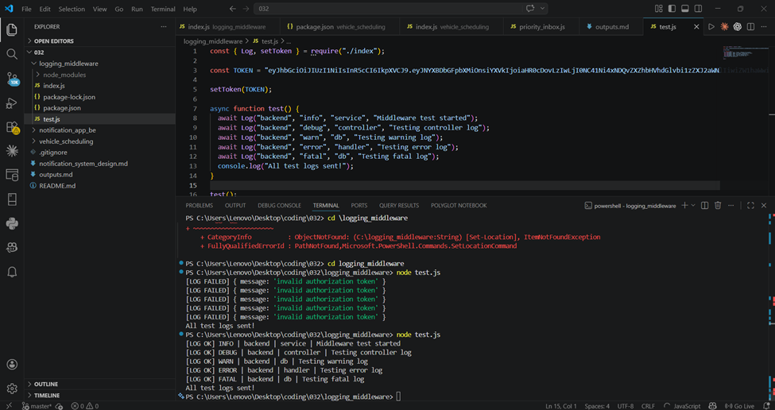

# Output Screenshots

## Logging Middleware

### Logs API - Postman

## Vehicle Maintenance Scheduler

### Depots API - Postman

### Vehicles API - Postman

### Vehicle Scheduling - Terminal Output

---

## Campus Notifications Microservice

### Notifications API - Postman

### Priority Inbox - Terminal Output (Stage 6)

